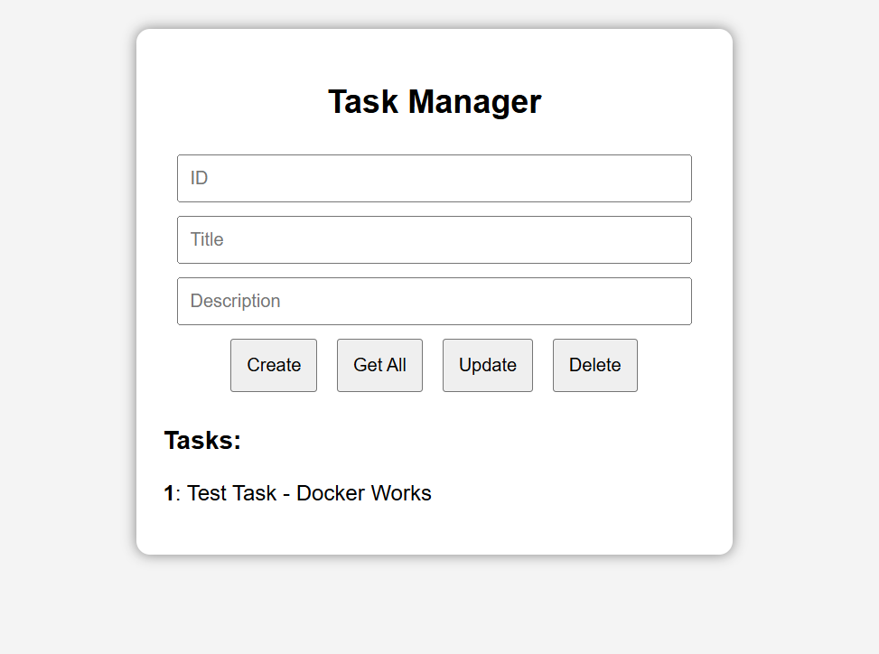
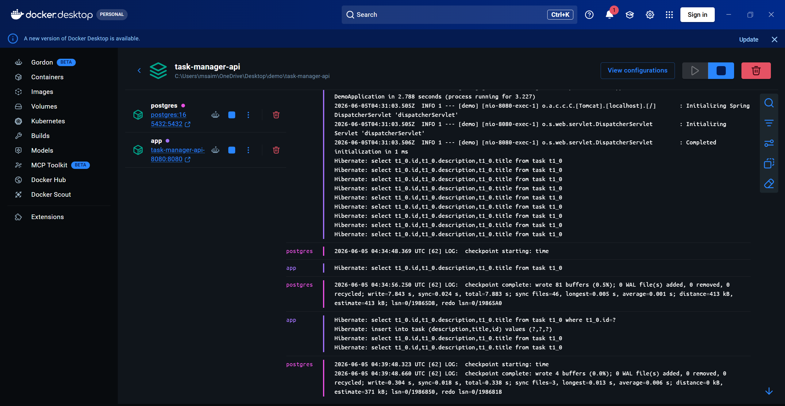

# Task Manager Application

A full-stack task management application built using Java, Spring Boot, PostgreSQL, and Docker. The application allows users to create, retrieve, update, and delete tasks through a web interface while persisting data in a PostgreSQL database.

## Features

* Create, retrieve, update, and delete tasks (CRUD operations)
* RESTful backend API developed with Spring Boot
* PostgreSQL database integration using Spring Data JPA and Hibernate
* Dockerized application and database using Docker Compose
* Automated database schema creation through Hibernate
* Simple web-based user interface for task management

## Technologies

* Java 21
* Spring Boot
* Spring Data JPA
* Hibernate
* PostgreSQL
* Docker
* Docker Compose
* Maven
* HTML/CSS/JavaScript

## Architecture

Frontend (HTML/CSS/JavaScript)
↓
Spring Boot REST API
↓
Spring Data JPA / Hibernate
↓
PostgreSQL Database

## Running the Application

### Prerequisites

* Docker Desktop

### Build and Run

```bash
docker compose up --build
```

The application will be available at:

```text
http://localhost:8080
```

### Stop the Application

```bash
docker compose down
```

## Screenshots

### Task Manager Interface



### Docker Containers Running



## Learning Outcomes

This project provided practical experience with:

* Backend development using Spring Boot
* Database design and persistence with PostgreSQL
* REST API development
* Containerization using Docker
* Multi-container deployment using Docker Compose
* Debugging application and database connectivity issues

## Author

Saim Muhammad

Bachelor of Software Engineering

Macquarie University
